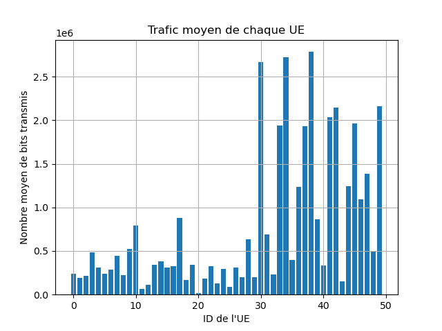

# ELE8702-H24-Lab3

Lab 3 of ELE8702 class 

## Dependencies

- **Package:** pdftk

### Installation Instructions:

#### Linux:
To install pdftk on Linux, please use your distribution's package manager:

- **Ubuntu/Debian:**
  ```
  sudo apt install pdftk
  ```
- **Arch Linux:**
  ```
 sudo pacman -S pdftk
  ```  

#### Windows:
Please install it by going to [this website](https://www.pdflabs.com/tools/pdftk-the-pdf-toolkit/) and downloading the .exe file. During installation, make sure to select the 'Add application directory to your environmental path' option.


## Plots :





## PDF of combined plots :

- [Lab 3 Graphiques](lab3_eq7_graphiques.pdf)